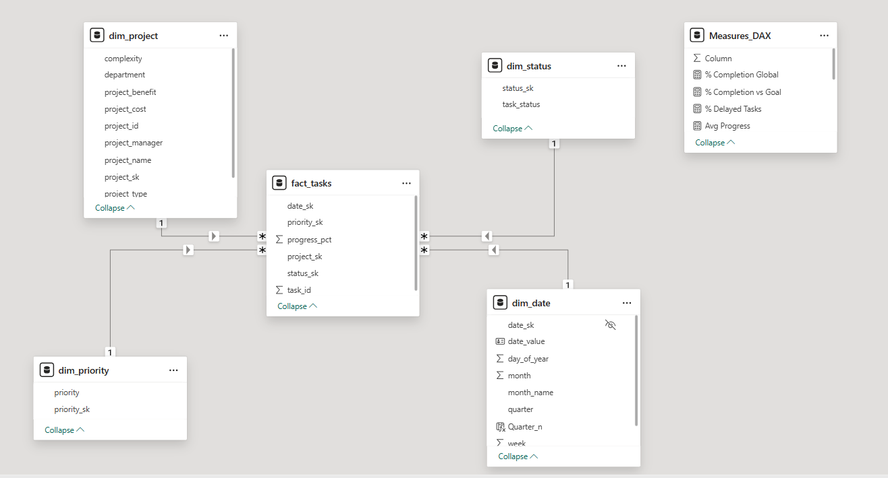
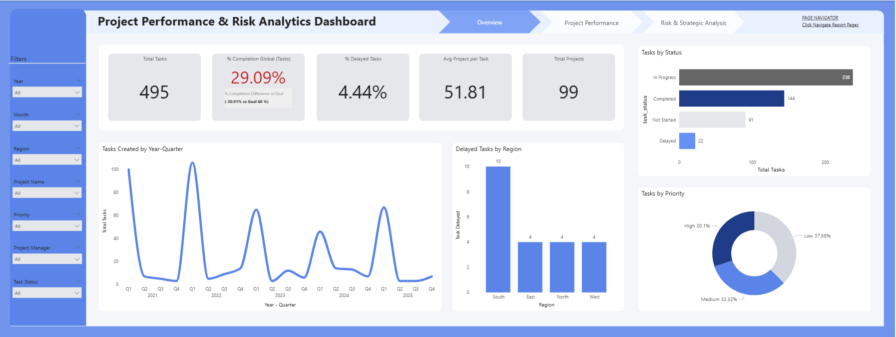
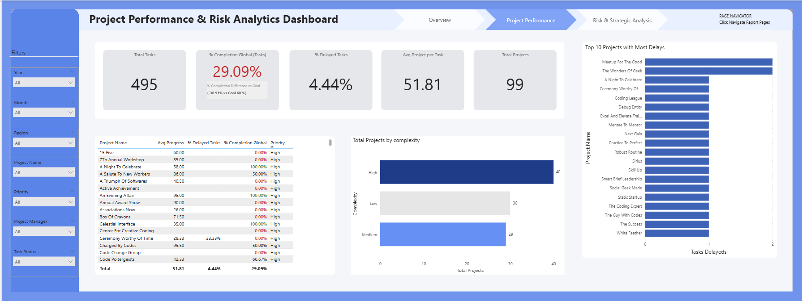
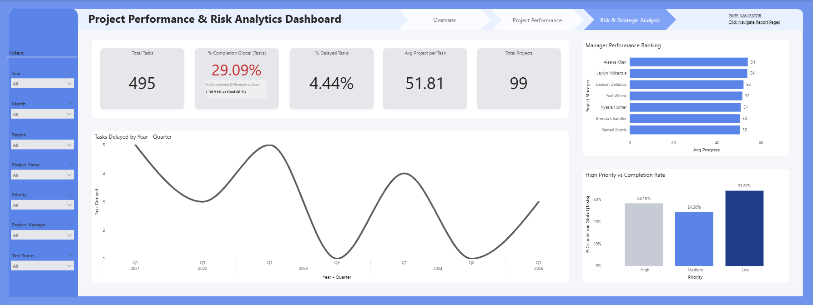
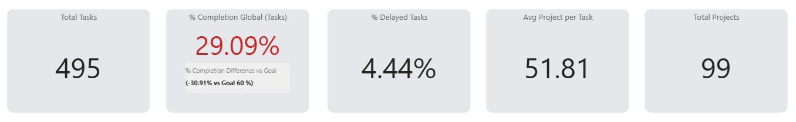

# Project_Performance_Risk_Analysis_Dashboard
## Project Performance & Risk Analysis Dashboard
## Descripción del Proyecto

Este proyecto consiste en el desarrollo de un dashboard estratégico en Power BI orientado al análisis del desempeño de proyectos, seguimiento de tareas y evaluación de riesgos operativos.
El objetivo principal es transformar datos operativos a nivel de tareas en información ejecutiva que facilite la toma de decisiones basada en indicadores clave de rendimiento (KPIs).
El dashboard permite evaluar el nivel de cumplimiento, identificar retrasos, analizar el desempeño de los responsables y detectar proyectos con mayor exposición al riesgo.

## Objetivos del Análisis
*Evaluar el porcentaje global de cumplimiento de tareas.
*Analizar la evolución de tareas retrasadas en el tiempo.
*Determinar si las tareas de alta prioridad están siendo gestionadas correctamente.
*Identificar qué proyectos presentan mayor riesgo.
*Comparar el desempeño entre responsables de proyecto.

## Preguntas de Negocio

Este dashboard responde a las siguientes preguntas estratégicas:
¿Estamos cumpliendo con los objetivos de ejecución?
¿Las tareas prioritarias reciben la atención adecuada?
¿Existen patrones de retraso en determinados períodos?
¿Qué proyectos presentan mayor riesgo operativo?
¿Qué responsables muestran mejor desempeño?

## Modelo de Datos

El modelo de datos fue diseñado bajo un esquema estrella (Star Schema), optimizando el rendimiento y la claridad analítica.
* Tabla de Hechos:
fact_tasks
* Tablas Dimensión:
dim_project
dim_status
dim_priority
dim_date
dim_region

Este enfoque permite segmentar y analizar la información de forma eficiente desde múltiples perspectivas.

## Indicadores Clave (KPIs)

Total de tareas
Total de proyectos
% Completion Global
% Delayed Tasks
Average Progress
Completion vs Goal (Meta establecida: 60%)

Se implementaron medidas en DAX para el cálculo dinámico de métricas y análisis contextual por dimensión.

## Estructura del Dashboard
1️.- Overview
Vista ejecutiva general con KPIs principales, distribución de estados y análisis de retrasos por región.

2️.- Performance Analysis
Análisis del desempeño por prioridad y ranking de responsables según progreso promedio.

3️.- Risk Analysis
Identificación de proyectos con mayor número de tareas retrasadas y evaluación del riesgo operativo.

## Principales Hallazgos
El porcentaje global de cumplimiento se encuentra en 29%, por debajo de la meta establecida del 60%.
Las tareas de alta prioridad presentan variaciones en su nivel de ejecución.
Existen incrementos en tareas retrasadas en determinados trimestres.
Algunos proyectos concentran un mayor número de retrasos, representando mayor riesgo.

## Herramientas Utilizadas
Dataset extraido de Kaglee
SQL (Para limpieza de dataset y para construcción de modelo de estrella)
Microsoft Power BI (Para visualización de resultados)
DAX (Para construcción de medidas)
Power Query (Para verificación de formatos en los datos)
Modelado Dimensional (Esquema Estrella)

## Vista Previa del Dashboard

## KPIs

## Autora

Whendy Yohaly Ocampo Mejia
Analista de Datos | Business Intelligence
